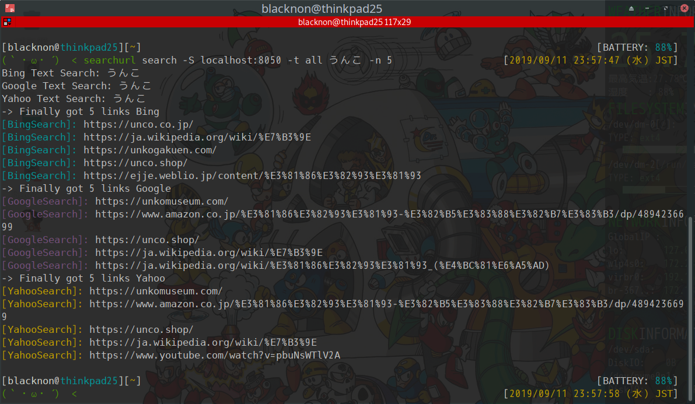

searchurl
===

Bing, Google, Yahooの検索結果をスクレイピングして検索結果のURLを一覧にして出力するコマンド。サジェストも対応。

## Install

    git clone git@github.com:blacknon/searchurl.git
    cd searchurl
    pip install -U ./

## Usage

### search

    # 検索(Google検索、上限300件)
    searchurl search うんこ
    searchurl search site:unko.org

    # 検索エンジン指定(Bing, Google, Yahoo)
    searchurl search -t bing うんこ
    searchurl search -t google うんこ
    searchurl search -t yahoo うんこ

    # 検索件数指定
    searchurl search -n 10 うんこ

    # Splash使用
    searchurl search -S localhost:8050 うんこ

    # Proxy使用
    searchurl search -P socks5://localhost:8000 うんこ

### suggest

    # サジェスト検索(Google)
    searchurl suggest うんこ

    # 検索エンジン指定(Bing, Google, Yahoo)
    searchurl suggest -t bing うんこ
    searchurl suggest -t google うんこ
    searchurl suggest -t yahoo うんこ

    # サジェスト候補 キーワード追加検索
    searchurl suggest --jap うんこ  # 前後に日本語を入れてサジェスト検索
    searchurl suggest --alph うんこ # 前後にアルファベットを入れてサジェスト検索
    searchurl suggest --num うんこ  # 前後に数字を入れてサジェスト検索

    # Proxy使用
    searchurl suggest -P socks5://localhost:8000 うんこ

## Note

### Splashについて

基本的には[Splash](https://github.com/scrapinghub/splash)を利用したほうがよい。\
以下、`Docker`のコンテナpull及び起動コマンド。

    docker pull scrapinghub/splash
    docker run -d --restart=always -it -p 8050:8050 scrapinghub/splash --disable-private-mode

### 参考

* [【Python】Googleの検索結果をアクセス制限なしで取得する - Qiita](https://qiita.com/derodero24/items/949ac666b18d567e9b61)
