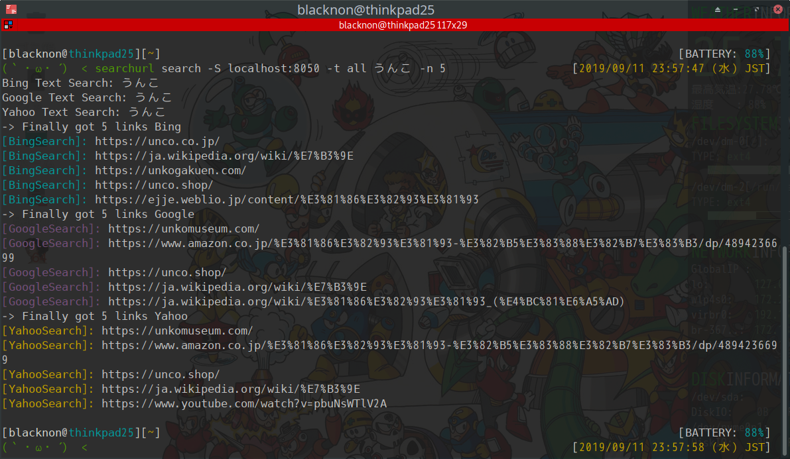
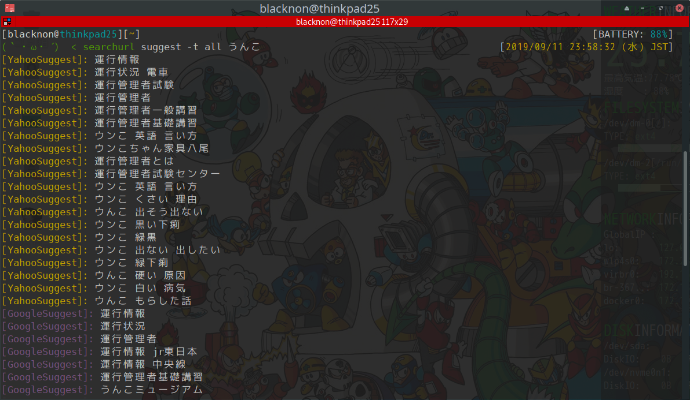

websearch
===

Baidu, Bing, Google, Yahooの検索結果をスクレイピングして検索結果のURLを一覧にして出力するコマンド。サジェストも対応。\
Baiduは日本語の結果は大体帰ってこないので、基本中国語とか.cnドメインへの対応用。


<p align="center">


</p>

## Install

    ```bash
    git clone git@github.com:blacknon/websearch.git
    cd websearch
    pip install -U ./
    ```


## Usage

### command

#### search

    ```bash
    # 検索(Google検索、デフォルト上限は300件)
    websearch search うんこ
    websearch search site:unko.org

    # 検索エンジン指定(Baidu, Bing, Google, Yahoo)
    websearch search -t baidu うんこ
    websearch search -t bing うんこ
    websearch search -t google うんこ
    websearch search -t yahoo うんこ

    # 検索件数指定
    websearch search -n 10 うんこ

    # 検索期間指定(Baiduは対象外)
    websearch search --start 2019-01-01 --end 2019-01-30 うんこ

    # Splash使用
    websearch search -S localhost:8050 うんこ

    # Proxy使用
    websearch search -P socks5://localhost:8000 うんこ

    # SplashからProxy使用(docker-machineだと疎通が取れないので不可)
    websearch search　-S localhost:8050 -P socks5://localhost:8000 うんこ # Linuxの場合
    websearch search　-S localhost:8050 -P socks5://host.docker.internal:8000 うんこ # Docker for Macの場合
    ```


#### suggest

    ```bash
    # サジェスト検索(Google)
    websearch suggest うんこ

    # 検索エンジン指定(Bing, Google, Yahoo)
    websearch suggest -t baidu うんこ
    websearch suggest -t bing うんこ
    websearch suggest -t google うんこ
    websearch suggest -t yahoo うんこ

    # サジェスト候補 キーワード追加検索
    websearch suggest --jap うんこ  # 前後に日本語を入れてサジェスト検索
    websearch suggest --alph うんこ # 前後にアルファベットを入れてサジェスト検索
    websearch suggest --num うんこ  # 前後に数字を入れてサジェスト検索

    # Proxy使用
    websearch suggest -P socks5://localhost:8000 うんこ
    ```


### lib

    ```python
    from websearch import search


    # google class
    google = search.SearchEngine()
    google.set('google')

    # Google検索を実行
    search_result = google.search('うんこ')

    # GoogleでのSuggestを取得
    suggest_result = google.suggest('うんこ')

    print(search_result)
    print(suggest_result)
    ```


## Note

### Splashについて

基本的には[Splash](https://github.com/scrapinghub/splash)を利用したほうがよい。\
以下、`Docker`のコンテナpull及び起動コマンド。

    ```bash
    docker pull scrapinghub/splash
    docker run -d --restart=always -it -p 8050:8050 scrapinghub/splash --disable-private-mode

    # Linuxの場合はnetworkをhostにしたほうがいい(Proxyを経由させるため)
    docker run -d --restart=always --network="host" -it -p 8050:8050 scrapinghub/splash --disable-private-mode
    ```


### 参考

* [【Python】Googleの検索結果をアクセス制限なしで取得する - Qiita](https://qiita.com/derodero24/items/949ac666b18d567e9b61)
